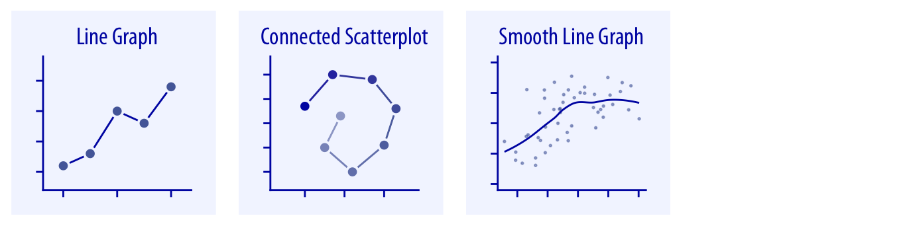
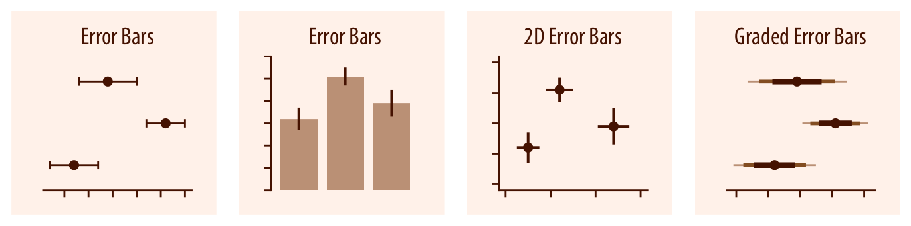
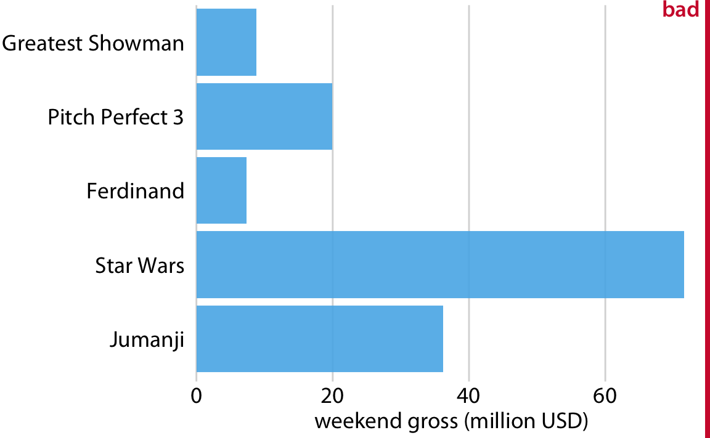
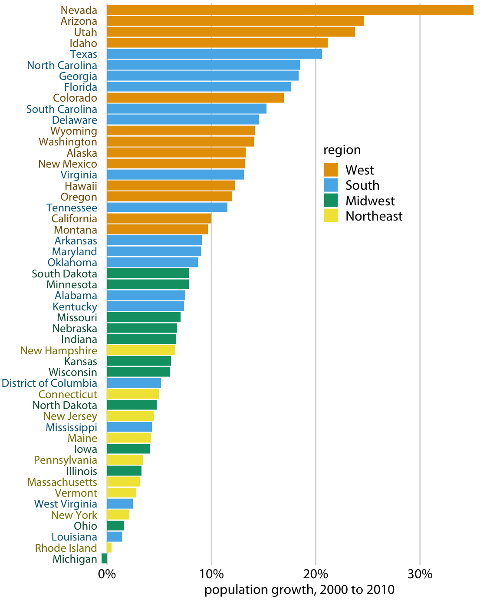
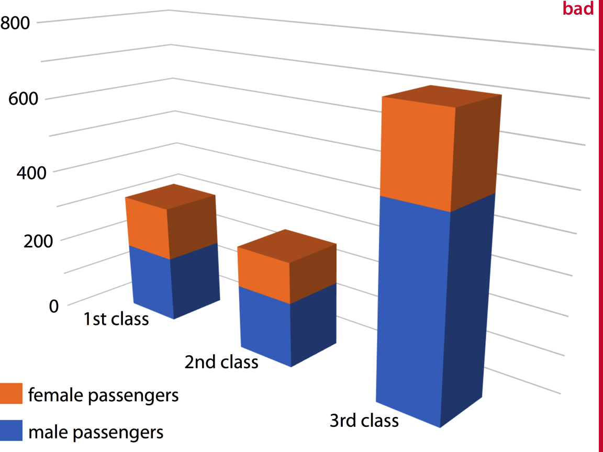

```{r setup, include=FALSE}
options(digits = 3)
knitr::opts_chunk$set(
  comment = "#>",
  echo = FALSE,
  collapse = TRUE,
  message = FALSE,
  warning = FALSE,
  out.width = "95%",
  fig.align = "center",
  fig.asp = 0.618, # 1 / phi
  fig.show = "hold"
)
```


## 内容

- 基本图形
  - 常用图表类型
  
- 绘图原则 
   - 绘图原则
   - 错题解析

- 代码实现 
   - 常用工具
   - **R** 和 ggplot2
   - 案例演示


# 基本图形

## 基本图形

用什么样的图，取决于我们的需求

- 呈现数量
- 呈现分布
- 呈现比例
- 呈现关联
- 呈现不确定性
- 呈现时间变化
- 呈现地理信息


## 呈现数量
```{r, out.width='100%', fig.align='center'}

```

## 分布图
```{r, out.width='100%', fig.align='center'}
knitr::include_graphics("images/single-distributions-1.png")
```

## 分布图
```{r, out.width='100%', fig.align='center'}
knitr::include_graphics("images/multiple-distributions-1.png")
```

## 呈现比例
```{r, out.width='100%', fig.align='center'}
knitr::include_graphics("images/proportions-1.png")
```

## 呈现比例
```{r, out.width='100%', fig.align='center'}
knitr::include_graphics("images/proportions-comp-1.png")
```

## 呈现比例
```{r, out.width='100%', fig.align='center'}

```


## x–y 关联图

```{r, out.width='100%', fig.align='center'}
knitr::include_graphics("images/basic-scatter-1.png")
```


## x–y 关联图
```{r, out.width='100%', fig.align='center'}
knitr::include_graphics("images/xy-binning-1.png")
```


## x–y 关联图
```{r, out.width='100%', fig.align='center'}

```

## 地图
```{r, out.width='100%', fig.align='center'}

```

## 呈现不确定性
```{r, out.width='100%', fig.align='center'}

```


## 呈现不确定性

```{r, out.width='100%', fig.align='center'}
knitr::include_graphics("images/confidence-dists-1.png")
```

## 呈现不确定性
```{r, out.width='100%', fig.align='center'}
knitr::include_graphics("images/confidence-bands-1.png")
```


# 基本原则 

## 基本原则

画图很容易，但画一张**好图**却不容易。


\Huge
\centering{准确传递信息，同时不增加读者心智负担}


## 比例对等原则

```{r, out.width='100%', fig.align='center'}
knitr::include_graphics("images/aes.pdf")
```
比例对等原则 (The principle of proportional ink)：

 - 图形元素的面积越大，代表的数值越大，成一定比例。

<!-- **The principle of proportional ink:** The sizes of shaded areas in a visualization need to be proportional to the data values they represent. -->


## 比例对等原则

```{r, out.width='100%', fig.align='center'}
knitr::include_graphics("images/hawaii-income-bars-bad-1.png")
```

## 比例对等原则
```{r, out.width='100%', fig.align='center'}
knitr::include_graphics("images/hawaii-income-bars-good-1.png")
```

柱状图应该从0开始

## 比例对等原则
```{r, out.width='100%', fig.align='center'}

```


## 排序很关键

```{r, out.width='100%', fig.align='center'}

```

## 排序很关键
```{r, out.width='100%', fig.align='center'}
knitr::include_graphics("images/boxoffice-horizontal-1.png")
```


## 排序很关键
```{r, out.width='100%', fig.align='center'}
knitr::include_graphics("images/income-by-age-sorted-1.png")
```

## 排序很关键
```{r, out.width='100%', fig.align='center'}
knitr::include_graphics("images/income-by-age-1.png")
```


## 处理好重叠点
```{r, out.width='100%', fig.align='center'}

```

## 处理好重叠点

```{r, out.width='100%', fig.align='center'}
knitr::include_graphics("images/mpg-cty-displ-transp-1.png")
```

## 处理好重叠点
```{r, out.width='100%', fig.align='center'}

```


## 色彩的运用

颜色，可以提升可视化效果，也可毁掉本来很好的图
```{r, out.width='85%', fig.align='center'}
knitr::include_graphics("images/popgrowth-vs-popsize-colored-1.png")
```


## 色彩的运用
增加标注比颜色强多了
```{r, out.width='100%', fig.align='center'}
knitr::include_graphics("images/popgrowth-vs-popsize-bw-1.png")
```


## 色彩的运用

```{r, out.width='86%', fig.align='center'}
knitr::include_graphics("images/popgrowth-vs-popsize_highlight.pdf")
```


## 色彩的运用
为了颜色而颜色，但一点信息量也没有
```{r, out.width='100%', fig.align='center'}

```


## 色彩的运用
```{r, out.width='100%', fig.align='center'}

```


## 色彩的运用
```{r, out.width='100%', fig.align='center'}
knitr::include_graphics("images/popgrowth-US-highlight-1.png")
```


## 色彩的运用

<!-- 如果用色彩表示数值的大小，应该使用单一色系或者分歧，颜色的差异 == 数值的差异 -->

```{r, out.width='100%', fig.align='center'}
knitr::include_graphics("images/map-Texas-rainbow-1.png")
```


## 色彩的运用

```{r, out.width='100%', fig.align='center'}
knitr::include_graphics("images/map-Texas-race-1.png")
```


## 色彩的运用

```{r, out.width='100%', fig.align='center'}
knitr::include_graphics("images/map-Texas-income-1.png")
```

## 色彩的运用

```{r, out.width='100%', fig.align='center'}

```


## 色彩的运用

```{r, out.width='100%', fig.align='center'}

```

\centering{\href{https://color.adobe.com/zh/create/color-wheel}{Adobe color}}


## 色彩的运用

```{r, out.width='68%', fig.align='center'}

```

\centering{\href{https://bookdown.org/wangminjie/R4DS/ggplot2-colors.html}{怎么样把配色放到我的图中呢?}}


## 必要的标注

```{r, out.width='100%', fig.align='center'}

```


## 必要的标注

```{r, out.width='100%', fig.align='center'}

```


## 必要的标注

```{r, out.width='100%', fig.align='center'}

```


## 必要的标注

```{r, out.width='100%', fig.align='center'}

```

## 必要的标注

```{r, out.width='100%', fig.align='center'}

```

## 必要的标注

```{r, out.width='100%', fig.align='center'}

```


## 图片组合
```{r, out.width='100%', fig.align='center'}

```

## 图片组合
```{r, out.width='100%', fig.align='center'}
knitr::include_graphics("images/athletes-composite-good-1.png")
```


## 尽可能不用3D图
```{r, out.width='60%', fig.align='center'}

```

\large\centering{ 80\% - 90\% ?}


## 尽可能不用3D图
```{r, out.width='100%', fig.align='center'}

```

## 尽可能不用3D图

```{r, out.width='90%', fig.align='center'}

```

## 尽可能不用3D图
```{r, out.width='100%', fig.align='center'}

```


## 图片格式
```{r, out.width='100%', fig.align='center'}
knitr::include_graphics("images/image-file-formats.png")
```

## 图片格式
```{r, out.width='100%', fig.align='center'}
knitr::include_graphics("images/image-file-formats-saving.pdf")
```


## 小节

准确传递信息，同时不增加读者心智负担

- 比例对等原则
- 排序很关键
- 处理好重叠点
- 色彩的运用
- 必要的标注
- 图片组合
- 规避3D图
- 图片格式


# 代码实现 


## 常用工具 


| 工具                            	| 用途     	| 使用     	|
|---------------------------------	|----------	|----------	|
| **Excel**, PowerBI, Tableau     	| 商用     	| 无需编程 	|
| **Origin**, Sigmaplot, GraphPad 	| 学术用   	| 无需编程 	|
| **R, Python, matlab**           	| 编程工具 	| 编程     	|
| Echarts, G2, D3.js              	| 网页交互 	| 编程     	|


## R是什么


R语言是用于统计分析，图形表示和报告的编程语言:

-   R 是一个\textcolor{red}{统计编程}语言（statistical programming）
-   R 可运行于多种平台之上，包括Windows、UNIX 和 Mac OS X
-   R 拥有顶尖水准的\textcolor{red}{制图}功能
-   R 是免费的
-   R 应用广泛，拥有丰富的\textcolor{red}{库包}
-   活跃的\textcolor{red}{社区}

官网定义：<https://www.r-project.org/>

## R路上的大神

2019 年 8 月，国际统计学年会将考普斯总统奖（被誉为统计学的诺贝尔奖）奖颁给 [ggplot2](https://ggplot2.tidyverse.org/) 的作者

```{r echo=FALSE, out.width = '50%'}
knitr::include_graphics("images/hadley-wickham.jpg")
```

-  [Hadley Wickham](http://hadley.nz/)，一个改变了R语言的人

## ggplot2

ggplot2是最受欢迎的 R 宏包，没有之一
 
```{r, echo=TRUE}
library(cranlogs)
  d <- cran_downloads(
        package = "ggplot2",
           from = "2020-01-01",
             to = "2020-09-01"
       )

sum(d$count)
```

## ggplot2 语法

```{r, out.width='100%', fig.align='center', echo = FALSE}
knitr::include_graphics("images/ggplot2_syntax1.pdf")
```


## ggplot2 语法很容易理解

\scriptsize
\begincols[T]
\begincol[T]{.45\textwidth}
```{r, echo=TRUE, eval=FALSE}
ggplot(mpg, aes(displ, hwy)) + 
  geom_point() 
```
\endcol

\begincol[T]{.6\textwidth}
```{r, fig.width= 3, out.width='100%', fig.align='center', echo=FALSE}
library(ggplot2)
ggplot(mpg, aes(displ, hwy)) + 
  geom_point()
```
\endcol
\endcols


## ggplot2 语法很容易理解

\scriptsize
\begincols[T]
\begincol[T]{.45\textwidth}
```{r, echo=TRUE, eval=FALSE}
ggplot(mpg, aes(displ, hwy)) + 
  geom_point(aes(color = class)) 
```
\endcol

\begincol[T]{.6\textwidth}
```{r, fig.width= 3, out.width='100%', fig.align='center', echo=FALSE}
library(ggplot2)
ggplot(mpg, aes(displ, hwy)) + 
  geom_point(aes(color = class), show.legend = F) 
```
\endcol
\endcols


## ggplot2 语法很容易理解

\scriptsize
\begincols[T]
\begincol[T]{.45\textwidth}
```{r, echo=TRUE, eval=FALSE}
ggplot(mpg, aes(displ, hwy)) + 
  geom_point(aes(color = class)) +
  geom_smooth()
```
\endcol

\begincol[T]{.6\textwidth}
```{r, fig.width= 3, out.width='100%', fig.align='center', echo=FALSE}
library(ggplot2)
ggplot(mpg, aes(displ, hwy)) + 
  geom_point(aes(color = class), show.legend = F) +
  geom_smooth()
```
\endcol
\endcols


## ggplot2 语法很容易理解

\scriptsize
\begincols[T]
\begincol[T]{.45\textwidth}
```{r, echo=TRUE, eval=FALSE}
ggplot(mpg, aes(displ, hwy)) +
  geom_point(aes(color = class)) +
  geom_smooth(
    method = "lm"
  )
```
\endcol

\begincol[T]{.6\textwidth}
```{r, fig.width= 3, out.width='100%', fig.align='center', echo=FALSE}
library(ggplot2)
ggplot(mpg, aes(displ, hwy)) + 
  geom_point(aes(color = class), show.legend = F) +
  geom_smooth(
    method = "lm"
    )
```
\endcol
\endcols


## ggplot2 语法很容易理解

\scriptsize
\begincols[T]
\begincol[T]{.45\textwidth}
```{r, echo=TRUE, eval=FALSE}
ggplot(mpg, aes(displ, hwy)) +
  geom_point(aes(color = class)) +
  geom_smooth(
    method = "lm",
    aes(group = class) 
  )
```


\endcol

\begincol[T]{.6\textwidth}
```{r, fig.width= 3, out.width='100%', fig.align='center', echo=FALSE}
library(ggplot2)
ggplot(mpg, aes(displ, hwy)) + 
  geom_point(aes(color = class), show.legend = F) +
  geom_smooth(
    method = lm, 
    aes(group =  class)
    )
```
\endcol
\endcols


# 案例解析（统计分布图）

## 统计分布图

美国林肯市，2016年天气温度数据
```{r, echo=FALSE}
library(tidyverse)
library(ggridges)
library(cowplot)

lincoln_df <- ggridges::lincoln_weather %>%
  mutate(
    month_short = fct_recode(
      Month,
      Jan = "January",
      Feb = "February",
      Mar = "March",
      Apr = "April",
      May = "May",
      Jun = "June",
      Jul = "July",
      Aug = "August",
      Sep = "September",
      Oct = "October",
      Nov = "November",
      Dec = "December"
    )
  ) %>%
  mutate(month_short = fct_rev(month_short)) %>%
  select(Month, month_short, `Mean Temperature [F]`)

lincoln_df %>% 
  head(7) %>% 
  knitr::kable(format = "latex", booktabs = TRUE) %>% 
  kableExtra::kable_styling(position = "center")
```

## points-errorbars 


```{r lincoln-temp-points-errorbars, fig.cap = '林肯市2016年气温变化图'}
lincoln_errbar <- lincoln_df %>%
  ggplot(aes(x = month_short, y = `Mean Temperature [F]`)) +
  stat_summary(
    fun.y = mean, fun.ymax = function(x) {
      mean(x) + 2 * sd(x)
    },
    fun.ymin = function(x) {
      mean(x) - 2 * sd(x)
    }, geom = "pointrange",
    fatten = 5
  ) +
  xlab("month") +
  ylab("mean temperature (°F)") +
  theme_classic(base_size = 14) +
  theme(
    axis.text = element_text(color = "black", size = 12),
    plot.margin = margin(3, 7, 3, 1.5)
  )

lincoln_errbar
```


## 箱线图

```{r boxplot-schematic, out.width = '100%', echo = FALSE, fig.cap = '箱线图示意图'}
knitr::include_graphics("images/boxplot-schematic.pdf")
```


## 箱线图


```{r lincoln-temp-boxplots, fig.cap = '林肯市2016年气温分布箱线图'}
lincoln_box <- lincoln_df %>%
  ggplot(aes(x = month_short, y = `Mean Temperature [F]`)) +
  geom_boxplot(fill = "grey90") +
  xlab("month") +
  ylab("mean temperature (°F)") +
  theme_classic(base_size = 14) +
  theme(
    axis.text = element_text(color = "black", size = 12),
    plot.margin = margin(3, 7, 3, 1.5)
  )

lincoln_box
```


## 小提琴图

```{r out.width = '80%', echo = FALSE, fig.cap =  '小提琴图示意图'}
knitr::include_graphics("images/violin-schematic-1.png")
```


## 小提琴图的优势

```{r out.width = '100%', echo = FALSE, fig.cap= "nature methods, vol.11, no.2, 2014"}
knitr::include_graphics("images/boxplot_nature_methods.pdf")
```


## 小提琴图

```{r lincoln-temp-violins, fig.cap =  '林肯市2016年气温分布小提琴图'}
lincoln_violin <- lincoln_df %>%
  ggplot(aes(x = month_short, y = `Mean Temperature [F]`)) +
  geom_violin(fill = "grey90") +
  xlab("month") +
  ylab("mean temperature (°F)") +
  theme_classic(base_size = 14) +
  theme(
    axis.text = element_text(color = "black", size = 12),
    plot.margin = margin(3, 7, 3, 1.5)
  )

lincoln_violin
```


## 散点图

```{r lincoln-temp-all-points, fig.cap =  '林肯市2016年气温分布散点图'}
lincoln_points <- lincoln_df %>%
  ggplot(aes(x = month_short, y = `Mean Temperature [F]`)) +
  geom_point(size = 0.75) +
  xlab("month") +
  ylab("mean temperature (°F)") +
  theme_classic(base_size = 14) +
  theme(
    axis.text = element_text(color = "black", size = 12),
    plot.margin = margin(3, 7, 3, 1.5)
  )

lincoln_points
```


## 抖散图

```{r lincoln-temp-jittered, fig.cap = '林肯市2016年气温分布抖散图'}
lincoln_jitter <- lincoln_df %>%
  ggplot(aes(x = month_short, y = `Mean Temperature [F]`)) +
  geom_point(position = position_jitter(width = .15, height = 0, seed = 320), size = 0.75) +
  xlab("month") +
  ylab("mean temperature (°F)") +
  theme_classic(base_size = 14) +
  theme(
    axis.text = element_text(
      color = "black",
      size = 12
    ),
    plot.margin = margin(3, 7, 3, 1.5)
  )

lincoln_jitter
```


## sina 图


```{r lincoln-temp-sina, fig.cap = '林肯市2016年气温分布 sina 图'}
lincoln_sina <- lincoln_df %>%
  ggplot(aes(x = month_short, y = `Mean Temperature [F]`)) +
  geom_violin(color = "transparent", fill = "gray90") +
  geom_jitter(width = 0.25, size = 0.85) +
  xlab("month") +
  ylab("mean temperature (°F)") +
  theme_classic(base_size = 14) +
  theme(
    axis.text = element_text(
      color = "black",
      size = 12
    ),
    plot.margin = margin(3, 7, 3, 1.5)
  )

lincoln_sina
```


## 山峦图

```{r temp-ridgeline, fig.cap =  '林肯市2016年气温分布山峦图'}
bandwidth <- 3.4

lincoln_df %>%
  ggplot(aes(x = `Mean Temperature [F]`, y = `Month`)) +
  geom_density_ridges(
    scale = 3, rel_min_height = 0.01,
    bandwidth = bandwidth, fill = colorspace::lighten("#56B4E9", .3), color = "white"
  ) +
  scale_x_continuous(
    name = "mean temperature (°F)",
    expand = c(0, 0), breaks = c(0, 25, 50, 75)
  ) +
  scale_y_discrete(name = NULL, expand = c(0, .2, 0, 2.6)) +
  theme_minimal(base_size = 14) +
  theme(
    axis.text = element_text(color = "black", size = 12),
    axis.text.y = element_text(vjust = 0),
    plot.margin = margin(3, 7, 3, 1.5)
  )
```


## 有颜色山峦图


```{r temp-ridgeline-colorbar, fig.asp = 0.652, fig.cap = '林肯市2016年气温分布山峦图（颜色越亮，温度越高）'}
bandwidth <- 3.4

lincoln_base <- lincoln_weather %>%
  ggplot(aes(x = `Mean Temperature [F]`, y = `Month`, fill = ..x..)) +
  geom_density_ridges_gradient(
    scale = 3, rel_min_height = 0.01, bandwidth = bandwidth,
    color = "black", size = 0.25
  ) +
  scale_x_continuous(
    name = "mean temperature (°F)",
    expand = c(0, 0), breaks = c(0, 25, 50, 75), labels = NULL
  ) +
  scale_y_discrete(name = NULL, expand = c(0, .2, 0, 2.6)) +
  colorspace::scale_fill_continuous_sequential(
    palette = "Heat",
    l1 = 20, l2 = 100, c2 = 0,
    rev = FALSE
  ) +
  guides(fill = "none") +
  theme_minimal(base_size = 14) +
  theme(
    axis.text = element_text(color = "black", size = 12),
    axis.text.y = element_text(vjust = 0),
    plot.margin = margin(3, 7, 3, 1.5)
  )


# x axis labels
temps <- data.frame(temp = c(0, 25, 50, 75))

# calculate corrected color ranges
# stat_joy uses the +/- 3*bandwidth calculation internally
tmin <- min(lincoln_weather$`Mean Temperature [F]`) - 3 * bandwidth
tmax <- max(lincoln_weather$`Mean Temperature [F]`) + 3 * bandwidth

xax <- axis_canvas(lincoln_base, axis = "x", ylim = c(0, 2)) +
  geom_ridgeline_gradient(
    data = data.frame(temp = seq(tmin, tmax, length.out = 100)),
    aes(x = temp, y = 1.1, height = .9, fill = temp),
    color = "transparent"
  ) +
  geom_text(
    data = temps, aes(x = temp, label = temp),
    color = "black", # family = "Myriad Pro",
    y = 0.9, hjust = 0.5, vjust = 1, size = 14 / .pt
  ) +
  colorspace::scale_fill_continuous_sequential(
    palette = "Heat",
    l1 = 20, l2 = 100, c2 = 0,
    rev = FALSE
  )

lincoln_final <- cowplot::insert_xaxis_grob(lincoln_base, xax, position = "bottom", height = unit(0.1, "null"))

ggdraw(lincoln_final)
```


## 一见钟情，还是相见恨晚？

```{r echo=FALSE, out.width = '100%'}

```


## 推荐书目

感谢[《Fundamentals of Data Visualization》](https://clauswilke.com/dataviz/)作者Claus O. Wilke，为大家写了这本非常好的书

- [R for Data Science](https://r4ds.had.co.nz/)
- [ggplot2: Elegant Graphics for Data Analysis](https://ggplot2-book.org/)
- [R Graphics Cookbook](https://r-graphics.org/)
- [Fundamentals of Data Visualization](https://serialmentor.com/dataviz/)
- [Data Visualization: A practical introduction](https://socviz.co/)


## join us


《\textcolor{red}{数据科学中的 R 语言}》讲解 R 语言入门基础、数据可视化、数据处理、探索性分析、统计建模以及在代表性领域的应用

- 课程性质：\textcolor{red}{研究生公选课}
- 上课地点：狮子山校区/成龙校区
- 课程内容：\href{https://bookdown.org/wangminjie/R4DS/}{\color{red}{https://bookdown.org/wangminjie/R4DS/}}
- 学时学分：32/2
- 选课方式：研究生院


## 我会努力的

\Large
\centering{
愿 R 语言成为你构建知识大厦的脚手架！
     38552109\textcolor{red}{@}qq.com
}
```{r echo=FALSE, out.width = '30%', fig.align='center'}

```


## 谢谢观看

```{r echo=FALSE, out.width = '85%', fig.width = 6, fig.asp= 0.816, fig.align='center', fig.showtext=TRUE}
library(ggplot2)
library(ggtext)

load("data/mooncake.rda")

ggplot(mooncake, aes(x, y)) +
  geom_point(size = 0.8) +
  scale_y_reverse() +
  labs(
    title = "<b><span style ='font-size:18pt'>祝大家中秋节/国庆节快乐！</span></b><br>感谢四川师范大学<span style = 'color:red;'>研究生院</span>和<span style = 'color:red;'>图书馆</span>的信任和支持。",
    caption = "感谢 biobabble 宏包提供月饼数据", 
    x = NULL,
    y = NULL
  ) +
 theme(
    plot.caption = element_text(
      color = "#bc5090",
      size = 8,
      face = "italic"
      ),
    plot.title.position = "plot",
    plot.title = element_textbox_simple(
      size = 13,
      lineheight = 1,
      padding = margin(5.5, 5.5, 5.5, 5.5),
      margin = margin(0, 0, 5.5, 0),
      fill = "cornsilk"  )
    )
```
